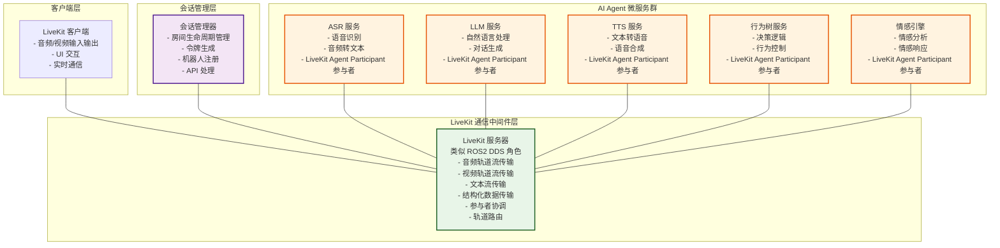
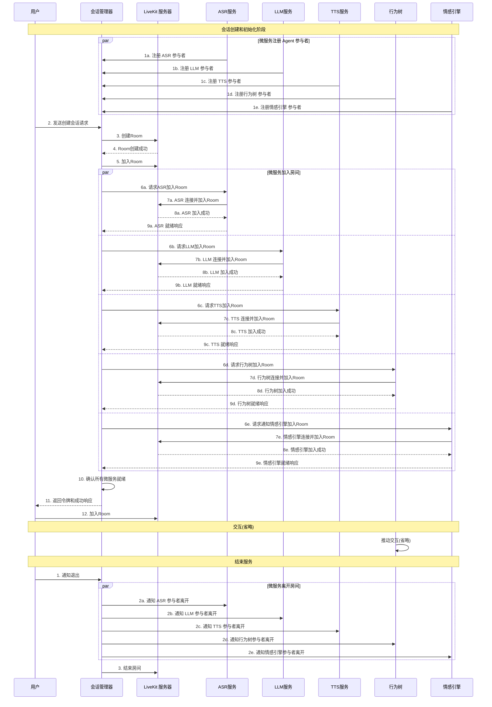

# 机器人后端架构文档
## 1. 概述
本文档描述基于 LiveKit 构建的智能机器人后端系统架构。该系统实现了一个完整的 AI 对话机器人后端，支持实时语音交互、多模态输入输出和分布式微服务架构。系统主要包含三个核心组件：会话管理器、用户客户端和 AI Agent 微服务群，所有组件通过 LiveKit (基于WebRTC)作为通信中间件进行协调和数据交换。

---
## 2. 核心概念
2.1 LiveKit 作为通信中间件
LiveKit 在本系统中扮演类似 ROS2 中 DDS（Data Distribution Service）的角色，作为分布式通信中间件，负责：
1. 流式传输音频（Audio Streaming）
2. 流式传输视频（Video Streaming）
3. 流式传输文本（Text Streaming）
4. 发送结构化数据（Structured Data Transmission）
2.2 LiveKit 基础概念
- Room（房间）: 实时会话的容器，包含一个或多个参与者
  - 每个房间都有唯一的名称标识
  - 房间可以动态创建和销毁
  - 房间状态变化会实时通知所有参与者
- Participant（参与者）: 参与实时会话的用户或进程，具有唯一身份标识
  - 参与者可以发布（publish）和订阅（subscribe）轨道
  - 支持参与者元数据和属性自定义
- Track（轨道）: 信息流，可以是音频、视频或自定义数据
  - Audio Track: 音频数据流，支持多种编解码格式
  - Video Track: 视频数据流，支持多分辨率和自适应码率
  - Data Track: 自定义数据流，支持二进制和文本数据
  - 每个轨道都有对应的 TrackPublication 对象管理发布状态
- TrackPublication（轨道发布）: 管理轨道的发布和订阅状态
  - 包含轨道的元信息（名称、类型、来源等）
  - 控制轨道的订阅状态和静音状态
  - 支持选择性订阅以优化带宽使用
- Token（访问令牌）: JWT 格式的认证令牌
  - 包含参与者身份信息和权限设置
  - 控制参与者可以执行的操作（发布、订阅、管理等）
  - 支持令牌刷新和权限动态更新
2.3 参与者类型
- User Client: 用户客户端参与者
  - 这个可以是机器人上微服务让机器人可以听到,说话
- Agent Participants: AI 代理参与者

---
3. 系统组件
3.1 会话管理器 (Session Manager)
职责:
- 创建和管理房间会话的生命周期
- 处理 Web API 请求
- 生成 LiveKit 客户端连接令牌
- 注册和管理机器人参与者
- 协调房间创建和参与者加入流程
功能流程:
5. 接收 Web API 请求创建会话
6. 创建 LiveKit 房间
7. 注册预定义的机器人参与者
8. 生成客户端访问令牌
9. 等待所有机器人加入房间
10. 返回成功响应给客户端
3.2 客户端 (Client)
职责:
- 提供用户界面和交互功能
- 处理用户输入（音频、视频、UI 操作）
- 渲染输出（UI、音频播放）
- 与 LiveKit 服务器建立连接
功能特性:
- 音频/视频采集和播放
- 实时数据传输
- 用户界面交互
- 自动订阅/取消订阅轨道
3.3 AI Agent 微服务群 (AI Agent Microservices)
职责:
- 作为 LiveKit Client 参与者运行
- 通过 LiveKit 进行所有服务间通信
- 提供完整的 AI 对话和交互能力
- 实现智能语音助手功能
微服务组件:
- ASR 服务: 自动语音识别，将音频转换为文本
- LLM 服务: 大语言模型，处理自然语言理解和生成
- TTS 服务: 文本转语音，生成语音响应
- 行为树服务: 控制 Agent 的行为逻辑和决策流程
- 情感引擎服务: 分析和生成情感化的交互响应
4. 系统架构图

5. 交互时序图
